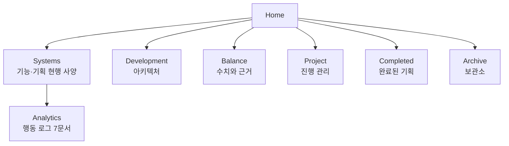

---
tags:
  - MOC
aliases:
  - 홈
  - 오늘도 장비 대여
  - Today's Weapon Rental
created: 2026-08-01
updated: 2026-08-01
---

# Home

> [!abstract] 오늘도 장비 대여 / `Today's Weapon Rental`
> 길드 경영 시뮬레이션. 모험가에게 모험을 주선하고 무기를 대여해 수수료를 받으며, 던전 모험 결과를 관리하고 평판을 쌓는다.
> Unity 2022.3.62f3 · 네임스페이스 `TodaysWeaponRental` · Alpha `0.0.2`

## 어디서 시작할까

| 알고 싶은 것 | 시작점 |
|---|---|
| **게임이 어떤 규칙으로 도는가** | [[Systems]] |
| **코드가 어떻게 구성돼 있는가** | [[Development]] |
| **이 수치는 왜 이 값인가** | [[Balance]] |
| **지금 뭘 하고 있는가** | [[지금할일]] |
| **유저가 실제로 어떻게 플레이하는가** | [[Analytics]] |
| **이 기획은 왜 이렇게 정해졌나** | [[Completed]] |

---

## 폴더 지도

| 폴더 | 다루는 질문 | 문서 수 |
|---|---|---|
| [[Systems]] | 무엇이 있고 어떤 규칙으로 도는가 | 40 |
| [[Development]] | 어떻게 만들어졌는가 | 6 |
| [[Balance]] | 왜 이 수치인가 | 39 |
| [[Project]] | 지금 무엇을 하는가 | 4 |
| [[Completed]] | 왜 이렇게 정했는가 | 12 |
| [[Archive]] | Vault 밖에 무엇이 있는가 | 2 |

---

## Systems — 게임 규칙

### 핵심 루프

- [[모험]] — [[모험_시스템]] · [[모험_UI]]
- [[모험가_시스템]] · [[모험가_UI]] · [[NPC등장확률]]
- [[무기]] — [[무기_시스템]] · [[무기_UI]]
- [[무기점_시스템]] · [[무기점_UI]]
- [[인벤토리_시스템]] · [[인벤토리_UI]]

### 정보와 선택

- [[통찰]] — [[통찰_시스템]] · [[통찰_UI]]
- [[대화]]
- [[아침이벤트_시스템]] · [[아침이벤트_UI]]
- [[퀘스트_시스템]] · [[퀘스트_UI]]

### 성장과 경제

- [[경제]] · [[평판]]
- [[유산_시스템]] · [[유산_UI]]

### 진행과 인프라

- [[시간]] · [[튜토리얼]] · [[저장]] · [[온라인]] · [[사운드]] · [[기타]]

### Analytics

- [[Analytics]] — 허브
- [[분석목표]] · [[이벤트_스펙]] · [[버튼_이벤트]] · [[퍼널]] · [[SQL_쿼리]] · [[대시보드_등록]] · [[Analytics_구현_메모]]

---

## Development — 코드 구조

- [[Development]] — 허브 (게임 개요 · 새 기능 체크리스트 · 외부 라이브러리)
- [[아키텍처]] — 4계층 · 5패턴 · 매니저 목록 · 폴더 구조
- [[데이터_구조]] — GameData / PlayerData · SO · Config
- [[데이터_접근_원칙]] — **아키텍처 원칙, 새 코드는 반드시 따른다**
- [[UI_구조]] — UIManager · View/Controller 쌍
- [[다국어_도입전략]] — Unity Localization 도입 전략 (미구현, 기획)

---

## Balance — 수치와 근거

### 기준 문서 (조정 전에 읽는다)

- [[밸런스_시뮬레이터_정리]] — **R 기준 밸런싱 체계(핵심)**
- [[골드_경제_구조]] — 지출처 전수 + 고정/변동 판정 원칙
- [[주간퀘스트_난이도_계수]] · [[주간퀘스트_레벨디자인]]
- [[시뮬레이터_설계]]
- [[밸런스_미적용_영역과_시뮬_로드맵]] — 남은 영역

### 변경 이력

- [[Balance]] — 32건 전체 목록 (날짜순)
- [[시뮬레이션_결과]] — 원시 출력이 Vault 밖에 있는 이유

---

## Project — 진행 관리

- [[지금할일]] — 현재 작업 · 보류 · 아이디어
- [[패치내역]] — 릴리스 노트
- [[테스트피드백]] — 플레이테스트 지적

---

## Completed — 완료된 기획

- [[Completed]] — 전체 목록
- 대표 문서: [[튜토리얼_기획]] · [[유산_시스템_기획]] · [[특성_밸런스_기획]] · [[모험_기분_시스템_기획]] · [[데드코드_정리]]

---

## 태그 체계

| 태그 | 의미 |
|---|---|
| `#System` | 게임 기능·규칙 현행 사양 |
| `#Development` | 아키텍처·코드 구조 |
| `#Balance` | 밸런싱 기준·수치 |
| `#Changelog` | 변경 건별 기록 |
| `#Reference` | 조정 전에 읽는 기준 문서 |
| `#Design` | 기획 제안서 |
| `#Completed` | 구현 완료 |
| `#Analytics` | 유저 행동 로그 |
| `#UI` | 화면·표시 |
| `#Project` · `#TODO` · `#Feedback` | 진행 관리 |
| `#Archive` | 보관 |
| `#MOC` | 지도 문서 |
| 도메인 태그 | `#모험` `#무기` `#통찰` `#모험가` `#퀘스트` `#인벤토리` `#경제` `#평판` `#유산` `#아침이벤트` `#무기점` `#튜토리얼` `#사운드` `#시간` `#대화` `#저장` `#온라인` |

---

## 문서 작성 규칙

> [!important] 새 문서를 만들 때
> - **Frontmatter**를 붙인다 — `tags` / `aliases`(필요 시) / `created` / `updated`
> - 문서 끝에 **`## Related`**로 관련 문서를 연결한다
> - 도메인 문서는 **`## 관련 코드`** 표로 규칙 -> 파일 위치를 잇는다 (줄 번호는 쓰지 않는다)
> - 파일명은 **Vault 전체에서 유일**해야 한다 (`[[문서명]]`이 파일명으로 해석되므로)

> [!danger] 내용을 수정하지 않는 문서
> [[패치내역]] · [[밸런스_미적용_영역과_시뮬_로드맵]] — 위치만 유지하고 본문은 손대지 않는다.

> [!warning] 코드가 문서보다 우선한다
> 문서와 코드가 충돌하면 **항상 코드가 맞다.** 문서는 레퍼런스일 뿐이다.
