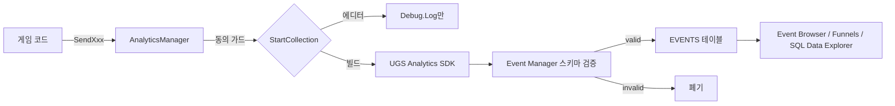

---
tags:
  - System
  - Analytics
  - MOC
aliases:
  - 애널리틱스
  - UGS Analytics
  - 유저 행동 로그
created: 2026-04-07
updated: 2026-08-01
---

# Analytics

> [!abstract] 한 줄 요약
> UGS Analytics로 유저 행동 로그를 수집해 **27개 분석 목표(G1~G27)**에 답하는 체계. 모든 이벤트는 최소 하나의 목표에 연결되어야 하며, 목표에 연결되지 않는 이벤트는 만들지 않는다.

## 목차

- [[분석목표]] — G1~G27 정의 · 구현 상태 · 예상 로그
- [[이벤트_스펙]] — 공통 파라미터 + Level 1/2/4 이벤트 정의
- [[버튼_이벤트]] — Level 3 `btn_clicked` 패널별 버튼 표
- [[퍼널]] — 대시보드 Funnel A~L
- [[SQL_쿼리]] — SQL Data Explorer 쿼리 템플릿 (G별 1:1)
- [[대시보드_등록]] — Event Manager 반영 절차(자동화) + 수신 검증 시나리오
- [[Analytics_구현_메모]] — 코드에서 이벤트를 발행하는 규칙

> [!important] 스키마의 단일 원본은 `Tools/Analytics/events.json`
> 위 문서들은 **왜 이 이벤트를 수집하는가**를 설명하는 설계 문서다. 실제로 대시보드에 등록되는 이벤트·파라미터 목록은 `events.json` 하나뿐이며, `analytics.py` 가 이것을 C# 코드와 대조하고 [[대시보드_등록]]의 목록을 생성하고 `dashboard_sync.py` 가 대시보드에 반영한다.

---

## 4단계 이벤트 구조

수집 이벤트는 추상도에 따라 4개 레벨로 나뉜다. 레벨은 **발행 위치**와 **무엇을 재는가**로 구분된다.

| Level | 이벤트 | 재는 것 | 발행 위치 | 문서 |
|---|---|---|---|---|
| **1** | `game_start`, `day_begin`, `game_over`, `phase_changed`, `visitor_spawned`, `morning_event_shown`, `speed_changed`, `tutorial_step` | 게임 흐름·상태 스냅샷 | 각 Manager | [[이벤트_스펙]] |
| **2** | `panel_opened` / `panel_closed` | 화면 진입·체류 | `UIManager` 중앙 처리 | [[이벤트_스펙]] |
| **3** | `btn_clicked` | 버튼을 **눌렀는가** (성패 무관) | 각 Controller (없으면 View) | [[버튼_이벤트]] |
| **4** | `adventure_started`, `blacksmith_*_done`, `gold_transaction` 등 | 실제로 **완료된** 행동 | 각 Manager 실행 완료 지점 | [[이벤트_스펙]] |

> [!info] Level 3과 Level 4는 일부러 중복된다
> Level 3은 "시도했는가", Level 4는 "성공했는가"를 잰다. 같은 행동이 두 레벨에 모두 잡히는 것이 정상이며, 이 차이가 곧 전환율([[퍼널]])이다.

> [!note] 4단계 밖의 이벤트 — `client_error`
> 빌드에서 발생한 Error/Exception/Assert 를 `LogPolicy` 가 리포팅한다. 플레이어 행동이 아니라 품질 지표라 레벨 체계 밖에 둔다. -> [[이벤트_스펙]]

---

## 수집 파이프라인

### 동의 게이트

`AnalyticsManager.StartCollection()`은 두 가드를 통과해야 실제 수집을 시작한다.

- `HasAskedConsent` — 동의 팝업에 응답했는가
- `IsOptedOut` — 수집을 철회했는가

호출 경로는 두 곳이며 서로 타이밍을 보완하므로 어느 쪽이 먼저 와도 안전하다.

1. 최초 실행 약관 팝업 (`TermsAgreementController` -> `SetConsent`)
2. 앱 재실행 시 UGS 초기화 직후 (`UGSManager.Start`)

옵션의 수집 철회 토글은 `SetOptOut`으로 즉시 중단/재개한다.

> [!warning] 등록하지 않은 이벤트는 버려진다
> 커스텀 이벤트·파라미터는 UGS 대시보드 **Event Manager**에 스키마를 먼저 등록해야 수집된다. 미등록은 invalid 처리로 폐기된다. **코드와 `events.json` 은 항상 같이 수정한다** — 어긋나면 CI(`analytics-schema-check`)가 실패시킨다. -> [[대시보드_등록]]

> [!caution] 에디터에서는 전송되지 않는다
> `Application.isEditor`면 전송 대신 `Debug.Log`로만 출력한다(실지표 오염 방지). 수신 검증은 반드시 스탠드얼론 빌드에서 Event Browser로 한다.

---

## 범위 밖 — SDK가 자동 수집하는 것

아래 지표는 커스텀 이벤트가 필요 없다. `AnalyticsService.Instance.StartDataCollection()` 호출만으로 UGS SDK가 자동 수집한다.

- DAU / MAU / 신규 유저(NRU)
- 리텐션 (D1 / D7 / D28)
- 세션 길이
- 앱 버전 (`clientVersion`), `session_id`, `timestamp`(UTC)

예외적으로 **복귀 유저(RRU)의 엄밀한 정의**(N일 이탈 후 복귀)와 **매출 지표(ARPU 계열)**만 SQL Data Explorer 또는 `transaction` 표준 이벤트가 따로 필요하다.

---

## 작업 순서

새 지표를 추가할 때는 아래 순서를 지킨다. 순서를 어기면 수집은 되는데 해석이 안 되거나(목표 없음), 코드는 보내는데 데이터가 안 쌓인다(스키마 미등록).

- [ ] 1. **목표를 먼저 정한다** -> [[분석목표]]에 G번호로 추가
- [ ] 2. 그 목표에 답할 **이벤트·파라미터를 설계** -> [[이벤트_스펙]] / [[버튼_이벤트]]
- [ ] 3. **`Tools/Analytics/events.json` 에 반영** (스키마 단일 원본)
- [ ] 4. **코드에서 발행** -> [[Analytics_구현_메모]]의 발행 위치 규칙
- [ ] 5. `python Tools/Analytics/analytics.py check` 통과 확인 (CI가 같은 검사를 돌린다)
- [ ] 6. `python Tools/Analytics/analytics.py render` 로 [[대시보드_등록]] 목록 갱신
- [ ] 7. `python Tools/Analytics/dashboard_sync.py apply` 로 **Event Manager 반영** -> `pull` 로 재확인
- [ ] 8. 빌드에서 **Event Browser로 수신 검증** (Invalid 0건)
- [ ] 9. **쿼리·퍼널 작성** -> [[SQL_쿼리]] / [[퍼널]]

---

## Related

- [[Systems]] — 시스템 기획 문서 인덱스
- [[Development]] — 아키텍처 레퍼런스 (Manager 계층 규칙)
- [[튜토리얼]] — 1일차 튜토리얼이 전 기능을 강제 통과시키므로 퍼널에서 제외해야 한다
- [[Balance]] — 실측 지표는 밸런싱 조정의 근거가 된다
