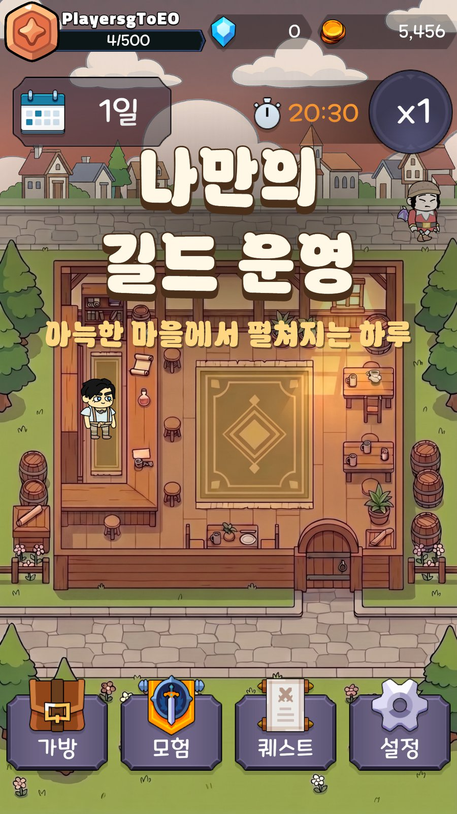
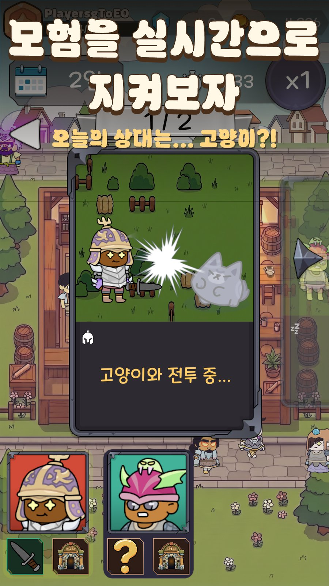

# 오늘도 장비 대여 (Today's Weapon Rental)

> 모험가에게 던전을 주선하고 무기를 대여해 수수료를 받는 **길드 경영 시뮬레이션** — Unity 2022.3 / C# · 1인 개발 · Google Play 정식 출시 (v1.0.0)

- Google Play: https://play.google.com/store/apps/details?id=com.IdeaBank.TodaysWeaponRental
- 소개 페이지: https://seunghee-2002.github.io/todays-weapon-rental/

      

## 이 저장소는 무엇인가

**코드 열람용 저장소입니다. 이 저장소만으로는 빌드되지 않습니다.**

원본 Unity 프로젝트에는 Asset Store에서 구매한 유료 에셋(UI 팩, 파티클, Spine 런타임, 사운드 등)과 아트·사운드 리소스가 포함되어 있어 재배포할 수 없습니다.
그래서 **직접 작성한 것만** 추려서 옮겼습니다.

| 폴더 | 원본 위치 | 내용 |
|---|---|---|
| [`Scripts/`](Scripts/) | `Assets/_Projects/Scripts/` | 게임 C# 전체 (307 파일 · 약 75,000줄) — `.meta` 제외 |
| [`Tools/CloudCode/`](Tools/CloudCode/) | 동일 | Unity Cloud Code 서버 함수 11개 (JS) + 배포 스크립트 |
| [`Tools/admin-site/`](Tools/admin-site/) | 동일 | 운영자용 밴/리더보드 관리 웹 (FastAPI + Google OAuth) + pytest |
| [`Tools/BalanceSim/`](Tools/BalanceSim/) | 동일 | 밸런스 시뮬레이터 배치 실행기 (Unity batchmode) |
| [`Tools/Analytics/`](Tools/Analytics/) · [`Tools/Localization/`](Tools/Localization/) | 동일 | 애널리틱스 대시보드 동기화 · 다국어 감사/일괄 적용 스크립트 |
| [`Docs/오늘도장비대여/`](Docs/오늘도장비대여/) | `Documents/` | 설계·시스템·밸런스 문서 (Obsidian 볼트) — 밸런스 변경 기록 35건 포함 |
| [`Docs/Simulation/`](Docs/Simulation/) | `Documents/Simulation/` | 시뮬레이터 리포트 샘플 (원본 255개 중 12개) |
| [`CLAUDE.md`](CLAUDE.md) | 루트 | 프로젝트 아키텍처·코딩 규칙 가이드 (AI 코딩 어시스턴트용으로 작성해 유지한 문서) |

포트폴리오 문서: [`PORTFOLIO.pdf`](PORTFOLIO.pdf)

## 어디부터 보면 좋은가

| 보고 싶은 것 | 시작점 |
|---|---|
| 전체 구조 (4계층 · 매니저 · 초기화 순서) | [`Docs/오늘도장비대여/Development/아키텍처.md`](Docs/오늘도장비대여/Development/아키텍처.md) → [`Scripts/Core/GameManager.cs`](Scripts/Core/GameManager.cs) |
| 데이터 접근 원칙 (SO 참조 vs ID 직렬화) | [`Docs/오늘도장비대여/Development/데이터_접근_원칙.md`](Docs/오늘도장비대여/Development/데이터_접근_원칙.md) |
| 밸런스 시뮬레이터 (헤드리스 100시드 × 100주) | [`Scripts/Editor/BalanceSimulator/SimCore.cs`](Scripts/Editor/BalanceSimulator/SimCore.cs) · [`Docs/오늘도장비대여/Balance/Reference/밸런스_시뮬레이터_정리.md`](Docs/오늘도장비대여/Balance/Reference/밸런스_시뮬레이터_정리.md) |
| 서버 검증 (닉네임 · 리더보드 · 밴 · 복구 코드) | [`Tools/CloudCode/`](Tools/CloudCode/) · [`Docs/오늘도장비대여/Systems/온라인.md`](Docs/오늘도장비대여/Systems/온라인.md) |
| 기획 데이터 파이프라인 (SO ↔ CSV) | [`Scripts/Editor/`](Scripts/Editor/) 의 `CSV*.cs` |
| 다국어 (ko · en · ja · zh-Hans) | [`Docs/오늘도장비대여/Development/다국어_도입전략.md`](Docs/오늘도장비대여/Development/다국어_도입전략.md) |

## 기술 스택

- **엔진** Unity 2022.3 LTS · C# · uGUI · TextMeshPro · Addressables · Spine (외형 애니메이션)
- **온라인** Unity Gaming Services — Authentication · Cloud Save · Cloud Code · Leaderboards · Analytics
- **다국어** Unity Localization (String Table · 로케일별 폰트 아틀라스)
- **툴/운영** Python (FastAPI · httpx · pytest), Google OAuth, Docker, PowerShell

## 라이선스

이 저장소의 코드는 원본 프로젝트와 같은 [GPL-3.0](LICENSE)을 따릅니다. 게임 내 아트·사운드·서드파티 에셋은 포함되어 있지 않으며 별도 라이선스 대상입니다.
